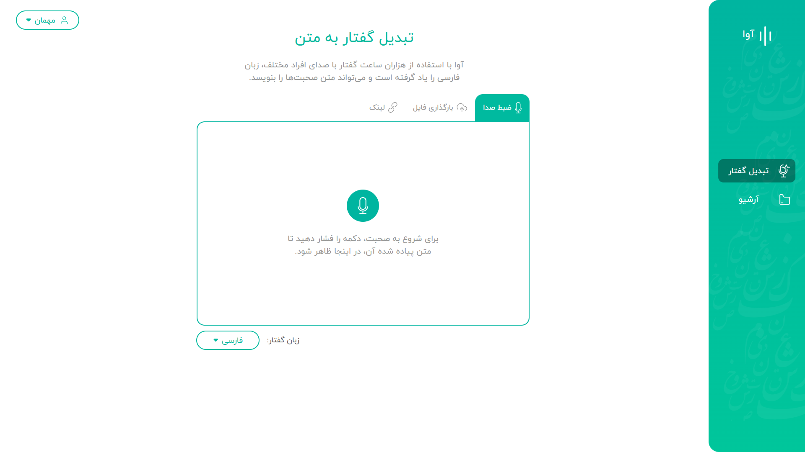
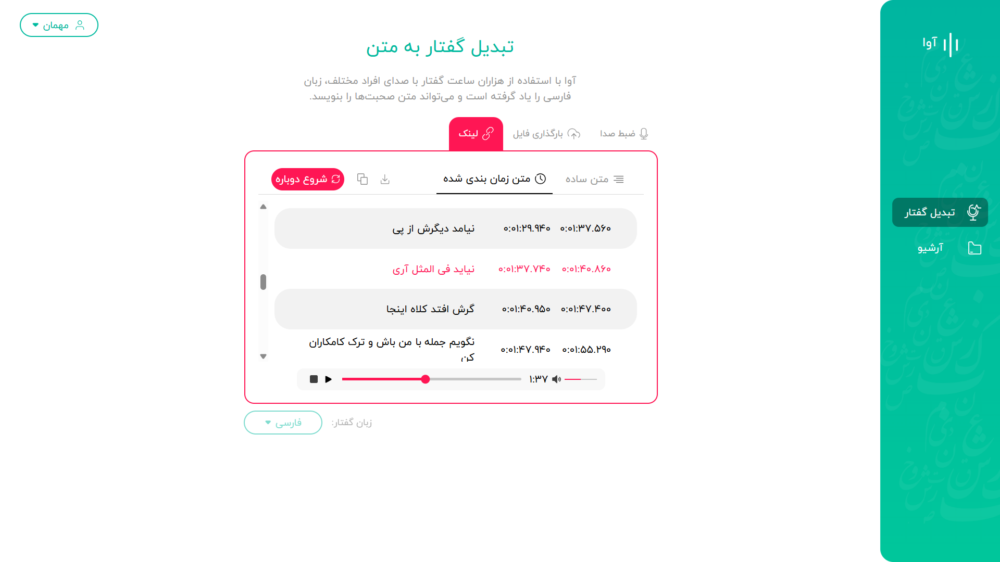
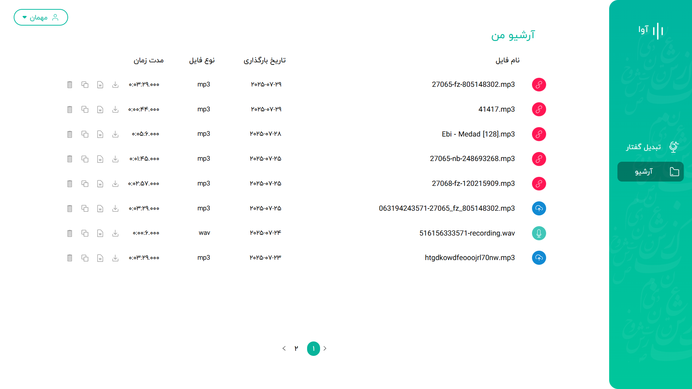
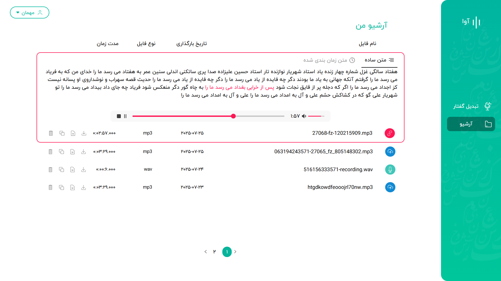

# Ava
## Overview
Ava is a frontend React App for an AI assistant that converts audio and video files into readable, time-synced text. 

## Features  
- **Flexible File Upload**  
  Users can submit audio or video files using one of the following methods:  
  1. **Record audio** 
  2. **Upload a file** (audio or video)  
  3. **Submit a file link** (audio or video)

- **Automated Transcription**  
  Uploaded files are processed through RESTful APIs and sent to the backend for transcription. Once complete, users can:  
  - View the full transcription (either time-synced or plain text)  
  - Play the original audio/video while the text highlights in sync for enhanced readability
  - Copy the transcribed text, or download the original audio/video file

- **Archive & Playback**  
  An archive page displays all previously transcribed files. Users can:  
  - Replay each file  
  - View the associated transcription (timed or plain)
  - Download the audio/video file
  - Copy the transcribed text or export it as a docx file
  - Delete any files they don't need

## Tech Stack  
- **Frontend Frameworks:** React.js, TailwindCSS
- **Programming Languages:** JavaScript, HTML, CSS 

## Screenshots
Recording page:

Reviewing Transcribed text:

Archive page:

